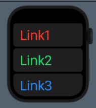

# Navigation Styles for Multiplatform Apps
Demonstrate the use of a Sidebar, SplitView, TabView and Navigation styles in a multiplatform app.

# NavigationView with List

The basic form of navigation using a `NavigationView`, `List` and `NavigationLink` is as follows:

```swift
import SwiftUI

struct ContentView: View {
    
    var colors: [Color] = [.red, .green, .blue, .yellow, .purple]
    
    var body: some View {
        NavigationView {
            List {
                ForEach(1...5, id: \.self) { val in
                    NavigationLink(destination: ViewLevel2(linkText: String(val), color: colors[val-1])) {
                        Text("Link\(val)")
                            .font(.largeTitle)
                            .foregroundColor(colors[val-1])
                            .padding()
                    }
                }
            }
        }
    }
}

struct ViewLevel2: View {
    
    var linkText = "Test"
    var color: Color = .black
    
    var body: some View {
        VStack {
            Text("ViewLevel2")
                .font(.largeTitle)
                .padding()
            
            Text("Text: \(linkText)")
                .font(.title)
                .foregroundColor(color)
        }
    }
}
```

The default behavior of `NavigationView` can be controlled using the `.navigationViewStyle()` modifier.
You can specify either of:
- `StackNavigationViewStyle()`, which displays only one view at a time
- `DoubleColumnNavigationViewStyle()` which displays two views in "split view" arrangement

Note that SwiftUI does not have a direct equivalent of UIKit's `UISplitViewController`. However, NavigationView allows you to achieve much the same thing.

```swift
NavigationView {
}
.navigationViewStyle(StackNavigationViewStyle())  // "Single View"


NavigationView {
}
.navigationViewStyle(DoubleColumnNavigationViewStyle())  // "Split View"
```

The appearance of the app for the various devices and orientations looks like this:

## iOS Portrait (iPhone 12 Pro Max)
Default (StackNavigationViewStyle) | DoubleColumnNavigationViewStyle | StackNavigationViewStyle
:--:|:--:|:--:
 | Same as default style | Same as default style

## iOS Landscape (iPhone 12 Pro Max)
Default (DoubleColumnNavigationViewStyle) | DoubleColumnNavigationViewStyle | StackNavigationViewStyle
:--:|:--:|:--:
 | Same as default style | 


## iPadOS Portrait (iPad Pro 12.9")
Default (DoubleColumnNavigationViewStyle) | DoubleColumnNavigationViewStyle | StackNavigationViewStyle
:--:|:--:|:--:
 | Same as default style | 

## iPadOS Landscape (iPad Pro 12.9")
Default (DoubleColumnNavigationViewStyle) | DoubleColumnNavigationViewStyle | StackNavigationViewStyle
:--:|:--:|:--:
 | Same as default style | 
Note button to hide navigation | |

## macOS, tvOS, watchOS
macOS | tvOS | watchOS
:--:|:--:|:--:
 |  | 

--- 

# Sidebar

Sidebars are an important part of UI design for larger devices (available for iOS, iPadOS and macOS).
See https://developer.apple.com/design/human-interface-guidelines/ios/bars/sidebars/.

A sidebar can very easily be added by using the `.listStyle(SidebarListStyle())` modifier on a `List`:

```swift
struct SidebarView: View {
    var body: some View {
        List {
            Label("What's New", systemImage: "wand.and.stars")
            Label("Messages", systemImage: "message")
            Label("List", systemImage: "list.bullet.rectangle")
            Section(header: Text("Personal")) {
                Label("Settings", systemImage: "gearshape")
                Label("Account", systemImage: "person.crop.circle")
                Section(header: Text("Very Personal SubMenu")) {
                    Label("Secret Stuff", systemImage: "text.badge.plus")
                    Label("Very Secret Stuff", systemImage: "lasso.sparkles")
                }
            }
        }
        .listStyle(SidebarListStyle())
        .navigationTitle("My Sidebar")
    }
}
```

You can add section headers to a sidebar so that disclosure indicators allow the user to collapse and expand sections.


We can make a few minimal changes to our app to get it to work with a sidebar.
First, make `SidebarView` the startup view:

```swift
@main
struct SwiftUI_SplitViewNavDemoApp: App {
    var body: some Scene {
        WindowGroup {
//            ContentView()
            SidebarView()
        }
    }
}
```

Now we'll modify `SidebarView` to define a `NavigationView` for the app.
Notice also how we use a `NavigationView` to move to `ListView`:

```swift
struct SidebarView: View {
    var body: some View {
        NavigationView {
            List {
                NavigationLink(destination: Text("What's New")) {
                    Label("What's New", systemImage: "wand.and.stars")
                }
                
                NavigationLink(destination: Text("Messages")) {
                    Label("Messages", systemImage: "message")
                }
                
                NavigationLink(destination: ListView()) {
                    Label("List", systemImage: "list.bullet.rectangle")
                }

                Section(header: Text("Personal")) {
                    Label("Settings", systemImage: "gearshape")
                    Label("Account", systemImage: "person.crop.circle")
                    Section(header: Text("Very Personal SubMenu")) {
                        Label("Secret Stuff", systemImage: "text.badge.plus")
                        Label("Very Secret Stuff", systemImage: "lasso.sparkles")
                    }
                }
            }
            .listStyle(SidebarListStyle())
            .navigationTitle("My Sidebar")
        }
    }
}

struct ListView: View {
    
    var colors: [Color] = [.red, .green, .blue, .yellow, .purple]
    
    var body: some View {
        List {
            ForEach(1...5, id: \.self) { val in
                NavigationLink(destination: ViewLevel2(linkText: String(val), color: colors[val-1])) {
                    Text("Link\(val)")
                        .font(.largeTitle)
                        .foregroundColor(colors[val-1])
                        .padding()
                }
            }
        }
    }
}
```

All the navigation links in `ListView` have `ViewLevel2` as their destination.

So, we logically have the following arrangement:


The appearance of our app with a sidebar  looks like this:

## iOS Portrait (iPhone 12 Pro Max)


## iOS Landscape (iPhone 12 Pro Max)


## iPadOS Portrait (iPad Pro 12.9")


## iPadOS Landscape (iPad Pro 12.9")


# Paged Navigation (TabView)

We can add a `TabbedPageView` to allow us to present a collection of pages (or tabs) to the user:

```swift
struct TabbedPageView: View {
    
    var body: some View {
        TabView {
            VStack {
                Text("Hello, world!").font(.largeTitle).padding()
                Image(systemName: "face.smiling.fill")
                    .resizable()
                    .frame(width: 150, height: 150)
                    .foregroundColor(.yellow)
            }
            .tabItem { Text("Tab1") }

            Text("Hello, world2!")
            .tabItem { Text("Tab2") }

            Text("Hello, world3!")
            .tabItem { Text("Tab3") }

            Text("Hello, world4!")
            .tabItem { Text("Tab4") }
        }
        .tabViewStyle(DefaultTabViewStyle())  // PageTabViewStyle() or DefaultTabViewStyle() to show tabs
        .indexViewStyle(PageIndexViewStyle(backgroundDisplayMode: .always))
    }
}
```

**Pages**:


**Tabs**:


Integrate this with our sidebar app as follows:

```swift
struct SidebarView: View {
    var body: some View {
        NavigationView {
            List {
                :
                NavigationLink(destination: TabbedPageView()) {
                    Label("Messages", systemImage: "message")
                }
                :
```

Running the app produces:

## iOS Portrait (iPhone 12 Pro Max)


## iOS Landscape (iPhone 12 Pro Max)


## macOS
Note that `TabView` on macOS doesn't support either `.tabViewStyle(DefaultTabViewStyle())` or `.indexViewStyle(PageIndexViewStyle(backgroundDisplayMode: .always))` so
that only tabs are displayed:


